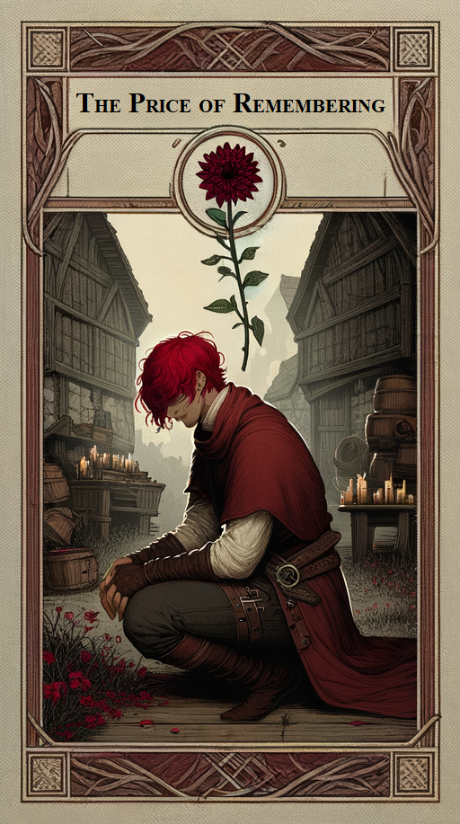

# THE PRICE OF REMEMBERING

## THE KINGKILLER CHRONICLE DAY THREE

**NOT PATRICK ROTHFUSS**

**VERSION 1.0.0**

## THE KINGKILLER CHRONICLE

**DAY ONE: THE NAME OF THE WIND**

**DAY TWO: THE WISE MAN'S FEAR**

**DAY THREE: THE PRICE OF REMEMBERING**

## LEGAL DISLAIMER

WE, THE AUTHORS of this fan fiction, can attest that we never sought permission, or consulted with the creator of the Kingkiller Chronicles series of novels; Patrick Rothfuss. This is a fan fiction work and is in no way endorsed or affiliated with either Patrick Rothfuss or the Kingkiller Chronicles series.

## FORWARD

WELCOME FELLOW ‘Old Knowers’ and ‘Proud Dreamers’. As an exercise I thought it might be interesting to try piecing together some of the prevailing book 3 theories together into a cut down version of what we may potentially get. Let me preface this by saying that this interpretation is unquestionably going to deviate, on many, if not all accounts from what I imagine will be Pat’s final version. At present I don’t believe there is sufficient information to truly piece The Doors of Stone together in its entirety, that doesn’t mean however it’s not worth trying. After so many years, it’s unlikely the fanbase would be able to settle on any one specific conclusion, a problem Pat himself will likely run into eventually, with that in mind, though it should go without saying, this is merely an ending, not the ending. It's also worth noting, given the considerably shorter length this will lack a lot of the intricacy and nuance that are the hallmarks of the series, and though there is potential to expand, it's worth gleaning community feedback first.

Though Kvothe states that stories seldom take the straightest way, for this fan version I’ve attempted to be as forthright as possible, employing as little artistic license as I can, using only what we can logically surmise from the existing books, Interviews, and other official media, in combination with some of the more accepted fan favourite theories developed over the years. The idea being to resolve as many plot threads as possible, whilst delivering as satisfying a conclusion to what’s already been established as I can. For the areas where I’ve been forced to fill in the gaps with original elements I’ve tried to do so in a limited and respectful manner.

My hope with this endeavor other than to entertain is that members of the community will consider the broader implications of theories posed, and that, like Kvothe when attempting to understand the Lethani, we can somehow pull the answers from within ourselves :)

For those of you reading this, there are no expectations put upon you for doing so, but should you wish to, and you have input, it would be greatly appreciated. As you will find, a lot of this is still quite rough, I’m hoping that with your assistance we can iron out its flaws before release. In regard to editing, I am open to the concept of making changes, particularly in the vein of matching the tone and prose of the existing novels, but am also open to plot changes, so long as the proposed alterations are not too extensive.

I appreciate this won't be for everyone, however I offer it without obligation, let, or lean :)

That all said, please enjoy.

## TABLE OF CONTENTS

* [*Title Page*](#the-price-of-remembering)
* [*Legal Disclaimer*](#legal-disclaimer)
* [*Forward*](#forward)
* [*Prologue*](Prologue.md)
* [CHAPTER 01](CHAPTER 01.md) - The Weight of Silence
* [CHAPTER 02](CHAPTER 02.md) - The Fragile Weight of Peace
* [CHAPTER 03](CHAPTER 03.md) - The Silent Toll
* [CHAPTER 04](CHAPTER 04.md) - Ears in the Wind
* [CHAPTER 05](CHAPTER 05.md) - The Art of Listening
* [CHAPTER 06](CHAPTER 06.md) - The Breath of the Peaks
* [CHAPTER 07](CHAPTER 07.md) - A Song Without Words
* [CHAPTER 08](CHAPTER 08.md) - Rare Things Vanish
* [CHAPTER 09](CHAPTER 09.md) - A Foolish Bargain
* [CHAPTER 10](CHAPTER 10.md) - Keys to the Past
* [CHAPTER 11](CHAPTER 11.md) - The Price We Pay
* [CHAPTER 12](CHAPTER 12.md) - Threads Unravel
* [CHAPTER 13](CHAPTER 13.md) - I Will Not Be Held
* [CHAPTER 14](CHAPTER 14.md) - Name in the Wall
* [CHAPTER 15](CHAPTER 15.md) - Missing
* [CHAPTER 16](CHAPTER 16.md) - Interlude - By Cover of Night
* [CHAPTER 17](CHAPTER 17.md) - Of Dancing Stones
* [CHAPTER 18](CHAPTER 18.md) - Define Lost
* [CHAPTER 19](CHAPTER 19.md) - Amber and Ivory
* [CHAPTER 20](CHAPTER 20.md) - Lured into the Current
* [CHAPTER 21](CHAPTER 21.md) - Kaysera
* [CHAPTER 22](CHAPTER 22.md) - Interlude – Crosscurrents
* [CHAPTER 23](CHAPTER 23.md) - The Thread Unravels
* [CHAPTER 24](CHAPTER 24.md) - The Whispering Quarter
* [CHAPTER 25](CHAPTER 25.md) - Reshi
* [CHAPTER 26](CHAPTER 26.md) - Stories We Tell Ourselve
* [CHAPTER 27](CHAPTER 27.md) - Old Acquaintances
* [CHAPTER 28](CHAPTER 28.md) - For the Greater Good
* [CHAPTER 29](CHAPTER 29.md) - Lockless
* [CHAPTER 30](CHAPTER 30.md) - Swirls in the Water
* [CHAPTER 31](CHAPTER 31.md) - The Deceit
* [CHAPTER 32](CHAPTER 32.md) - The Fall
* [CHAPTER 33](CHAPTER 33.md) - The Tower
* [CHAPTER 34](CHAPTER 34.md) - Command in the Chaos
* [CHAPTER 35](CHAPTER 35.md) - The Price of Loyalty
* [CHAPTER 36](CHAPTER 36.md) - Interlude - A Weight of Names
* [CHAPTER 37](CHAPTER 37.md) - The Breath After the Fall
* [CHAPTER 38](CHAPTER 38.md) - The Wolf and the Owl
* [CHAPTER 39](CHAPTER 39.md) - The Weight of Shadows
* [CHAPTER 40](CHAPTER 40.md) - Cinder
* [CHAPTER 41](CHAPTER 41.md) - Threadbare and Boundless
* [CHAPTER 42](CHAPTER 42.md) - Seven Words for Silence
* [CHAPTER 43](CHAPTER 43.md) - Interlude - Out of the Chill
* [CHAPTER 44](CHAPTER 44.md) - The Hollow Crown
* [CHAPTER 45](CHAPTER 45.md) - Once King, Always King
* [CHAPTER 46](CHAPTER 46.md) - The Illusion of Wholeness
* [CHAPTER 47](CHAPTER 47.md) - The Reckoning
* [CHAPTER 48](CHAPTER 48.md) - A Trap of Memory
* [CHAPTER 49](CHAPTER 49.md) - To Ash All Things Return
* [CHAPTER 50](CHAPTER 50.md) - The Proper Way
* [CHAPTER 51](CHAPTER 51.md) - A Silence of Three Parts
* [*Epilogue*](Epilogue.md)
* [*Appendix*](Appendix.md)
* [*Notes*](Notes.md)
