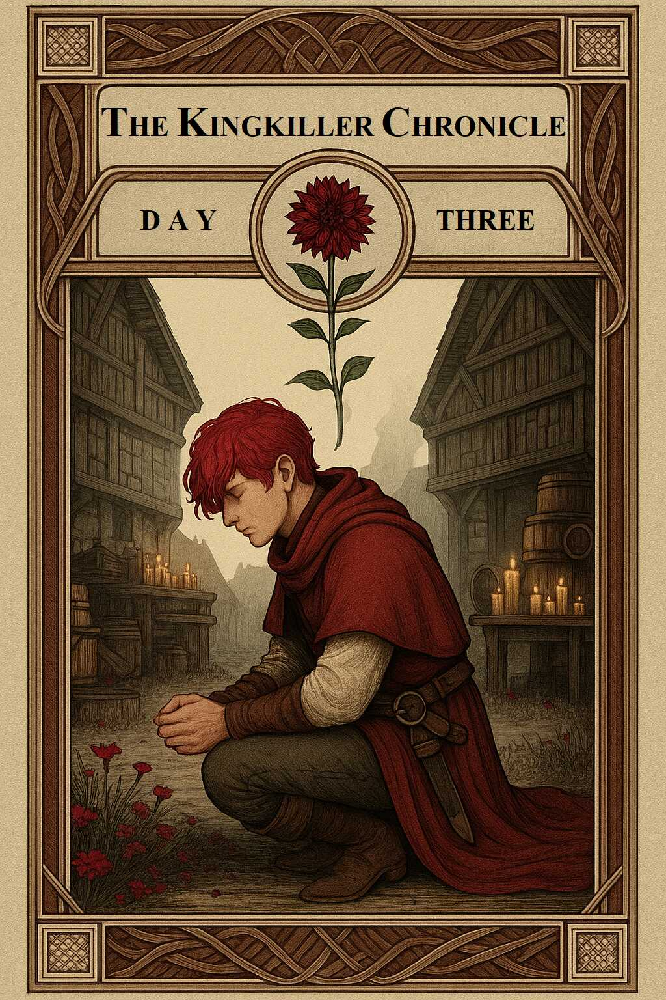

# THE PRICE OF REMEMBERING

**OR,**

# THE DOORS OF STONE SPECULATIVE MUSINGS

## THE KINGKILLER CHRONICLE DAY THREE

**NOT PATRICK ROTHFUSS**

**LATEST VERSION**

## THE KINGKILLER CHRONICLE

**DAY ONE: THE NAME OF THE WIND**

**DAY TWO: THE WISE MAN'S FEAR**

**DAY THREE: THE PRICE OF REMEMBERING**

## LEGAL DISCLAIMER.

WE, THE AUTHORS of this fan fiction, can attest that we never sought permission, or consulted with the creator of the Kingkiller Chronicles series of novels; Patrick Rothfuss. This is a fan fiction work and is in no way endorsed or affiliated with either Patrick Rothfuss or the Kingkiller Chronicles series.

## ACKNOWLEDGEMENTS.

> "We are like dwarfs on the shoulders of giants, so that we can see more than they, and things at a greater distance, not by virtue of any sharpness of sight on our part, or any physical distinction, but because we are carried high and raised up by their giant size." - Bernard de Chartres.

FIRST, I MUST THANK Patrick Rothfuss, who laid the foundation stone by stone, word by careful word. There is art in that work. It is deliberate, filled with quiet care and keen longing. To begin here is to sit beside a roaring fire, to listen for names in the crackling dark, to find the world new and strange again. Without such a beginning, I would have wandered off long ago, my interest spent, my feet sore.

Next, let me thank TacticalDo. His “Price of Remembering” found, if not the ending itself, then at least a hint of what the third book might be. In reading his words, I felt a door unlock. I realized that I too was allowed to shape an ending with my own hands. To draw out my own truths from within.

To those who shared their thoughts and theories, I owe you a debt. Flint striking flint. Bright sparks drawn out in dark places, kindling fires I might never have found alone. When ideas are tested, then tempered, then given breath, we all burn brighter for it. Many of your fancies proved fertile ground. The most fruitful, I have named in the appendix.

At last, let me thank all the quiet transcribers, those patient souls who listen and set words in careful rows. Hours of interviews and stories distilled into a card catalogue so that their secrets might be found and plucked from the shadows. Audio is a bramble, full of thorns and snags, but you gave me a lantern to see by, a path where before was only dark.

## FORWARD.

WELCOME FELLOW ‘Old Knowers’ and ‘Proud Dreamers’. As an exercise I thought it might be interesting to try piecing together some of the prevailing book 3 theories together into a cut down version of what we may potentially get. Let me preface this by saying that this interpretation is unquestionably going to deviate, on many, if not all accounts from what I imagine will be Pat’s final version. At present I don’t believe there is sufficient information to truly piece The Doors of Stone together in its entirety, that doesn’t mean however it’s not worth trying. After so many years, it’s unlikely the fanbase would be able to settle on any one specific conclusion, a problem Pat himself will likely run into eventually, with that in mind, though it should go without saying, this is merely an ending, not the ending. It's also worth noting, given the considerably shorter length this will lack a lot of the intricacy and nuance that are the hallmarks of the series, and though there is potential to expand, it's worth gleaning community feedback first.

Though Kvothe states that stories seldom take the straightest way, for this fan version I’ve attempted to be as forthright as possible, employing as little artistic license as I can, using only what we can logically surmise from the existing books, Interviews, and other official media, in combination with some of the more accepted fan favourite theories developed over the years. The idea being to resolve as many plot threads as possible, whilst delivering as satisfying a conclusion to what’s already been established as I can. For the areas where I’ve been forced to fill in the gaps with original elements I’ve tried to do so in a limited and respectful manner.

My hope with this endeavor other than to entertain is that members of the community will consider the broader implications of theories posed, and that, like Kvothe when attempting to understand the Lethani, we can somehow pull the answers from within ourselves :)

For those of you reading this, there are no expectations put upon you for doing so, but should you wish to, and you have input, it would be greatly appreciated. As you will find, a lot of this is still quite rough, I’m hoping that with your assistance we can iron out its flaws before release. In regard to editing, I am open to the concept of making changes, particularly in the vein of matching the tone and prose of the existing novels, but am also open to plot changes, so long as the proposed alterations are not too extensive.

I appreciate this won't be for everyone, however I offer it without obligation, let, or lean :)

That all said, please enjoy.

## RESOURCES

* [HTML](https://frypatch.github.io/The-Price-of-Remembering/) ~ 850KB
* [EPUB](https://github.com/frypatch/The-Price-of-Remembering/releases/latest) ~ 500KB
* [PDF](https://github.com/frypatch/The-Price-of-Remembering/releases/latest) ~ 1.8MB
* [TXT](https://github.com/frypatch/The-Price-of-Remembering/releases/latest) ~ 550KB
* [Workspace](https://github.com/frypatch/The-Price-of-Remembering/)
* [Archive](https://web.archive.org/web/2/https://frypatch.github.io/The-Price-of-Remembering/)

# CONTENTS

* [*Cover*](book/Cover.md).
* [*Half Title Page*](book/Half_Title_Page).
* [*Series Title Page*](book/Series_Title_Page).
* [*Title Page*](book/Title_Page).
* [*Legal Disclaimer*](book/Legal_Disclaimer).
* [*Acknowledgements*](book/Acknowledgements).
* [*Forward*](book/Forward).
* [*Contents*](book/Contents).
* [*Prologue*](book/Prologue).
* [CHAPTER 1](book/CHAPTER_01). The Weight of Silence.
* [CHAPTER 2](book/CHAPTER_02). The Fragile Weight of Peace.
* [CHAPTER 3](book/CHAPTER_03). The Silent Toll.
* [CHAPTER 4](book/CHAPTER_04). Ears in the Wind.
* [CHAPTER 5](book/CHAPTER_05). The Art of Listening.
* [CHAPTER 6](book/CHAPTER_06). The Breath of the Peaks.
* [CHAPTER 7](book/CHAPTER_07). A Song Without Words.
* [CHAPTER 8](book/CHAPTER_08). Rare Things Vanish.
* [CHAPTER 9](book/CHAPTER_09). A Foolish Bargin.
* [CHAPTER 10](book/CHAPTER_10). Keys to the Past.
* [CHAPTER 11](book/CHAPTER_11). The Price We Pay.
* [CHAPTER 12](book/CHAPTER_12). Threads Unravel.
* [CHAPTER 13](book/CHAPTER_13). I Will Not Be Held.
* [CHAPTER 14](book/CHAPTER_14). Name in the Wall.
* [CHAPTER 15](book/CHAPTER_15). Missing.
* [CHAPTER 16](book/CHAPTER_16). Interlude. By Cover of Night.
* [CHAPTER 17](book/CHAPTER_17). Of Dancing Stones.
* [CHAPTER 18](book/CHAPTER_18). Define Lost.
* [CHAPTER 19](book/CHAPTER_19). Amber and Ivory.
* [CHAPTER 20](book/CHAPTER_20). Lured Into the Current.
* [CHAPTER 21](book/CHAPTER_21). Kaysera.
* [CHAPTER 22](book/CHAPTER_22). Interlude. Crosscurrents.
* [CHAPTER 23](book/CHAPTER_23). The Thread Unravels.
* [CHAPTER 24](book/CHAPTER_24). The Whispering Quarter.
* [CHAPTER 25](book/CHAPTER_25). Reshi.
* [CHAPTER 26](book/CHAPTER_26). Stories We Tell Ourselves.
* [CHAPTER 27](book/CHAPTER_27). Old Acquaintances.
* [CHAPTER 28](book/CHAPTER_28). For the Greater Good.
* [CHAPTER 29](book/CHAPTER_29). Lockless.
* [CHAPTER 30](book/CHAPTER_30). Swirls in the Water.
* [CHAPTER 31](book/CHAPTER_31). The Deceit.
* [CHAPTER 32](book/CHAPTER_32). The Fall.
* [CHAPTER 33](book/CHAPTER_33). The Tower.
* [CHAPTER 34](book/CHAPTER_34). Command in the Chaos.
* [CHAPTER 35](book/CHAPTER_35). The Price of Loyalty.
* [CHAPTER 36](book/CHAPTER_36). Interlude. A Weight of Names.
* [CHAPTER 37](book/CHAPTER_37). The Breath After the Fall.
* [CHAPTER 38](book/CHAPTER_38). The Wolf and the Owl.
* [CHAPTER 39](book/CHAPTER_39). The Weight of Shadows.
* [CHAPTER 40](book/CHAPTER_40). Cinder.
* [CHAPTER 41](book/CHAPTER_41). Threadbare and Boundless.
* [CHAPTER 42](book/CHAPTER_42). Seven Words for Silence.
* [CHAPTER 43](book/CHAPTER_43). Interlude. Out of the Chill.
* [CHAPTER 44](book/CHAPTER_44). The Hollow Crown.
* [CHAPTER 45](book/CHAPTER_45). Once King, Always King.
* [CHAPTER 46](book/CHAPTER_46). The Illusion of Wholeness.
* [CHAPTER 47](book/CHAPTER_47). The Reckoning.
* [CHAPTER 48](book/CHAPTER_48). A Trap of Memory.
* [CHAPTER 49](book/CHAPTER_49). To Ash All Things Return.
* [CHAPTER 50](book/CHAPTER_50). The Proper Way.
* [CHAPTER 51](book/CHAPTER_51). A Silence of Three Parts.
* [*Epilogue*](book/Epilogue).
* [*Appendix*](book/Appendix).
* [*Notes*](book/Notes).
